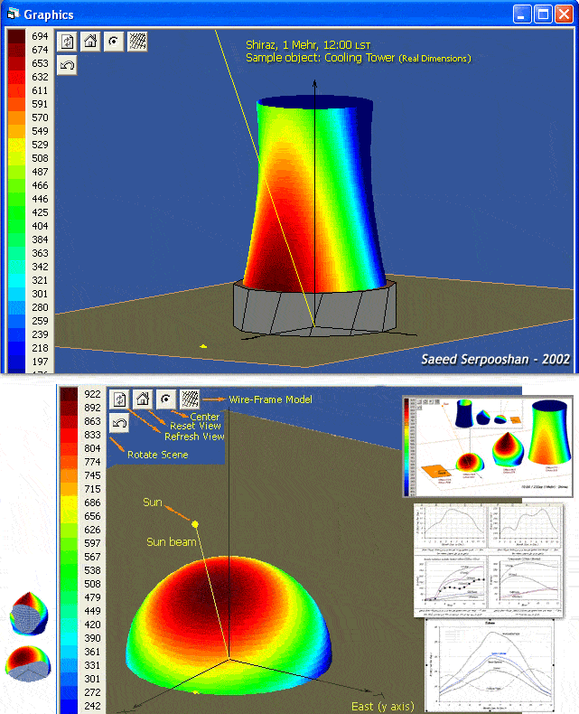



## SolarPro \(3D graphics just win\-API\)

### Description

SolarPro is a greate pure vb software to calculate solar radiation on 3D surfaces.

it has a powerful graphical interface using Win-API functions to show objects in 3D.

in graphic window use these keyboard-mouse for rotate/size:

(Ctrl)=Zoom , (Shift)=move or pan, (Mouse-Drag)=rotate

this program is not completed yet but most items are currently available.

it is recomended that run this prog in Win XP/2k and not in 98/Me

s.serpooshan
 
### More Info
 
- not completed yet

- some problems exist in Win98 platform

             |
---                |---
**Submitted On**   |2004-10-23 21:06:02
**By**             |[S\.Serpooshan](https://github.com/Planet-Source-Code/PSCIndex/blob/master/ByAuthor/s-serpooshan.md)
**Level**          |Advanced
**User Rating**    |4.9 (123 globes from 25 users)
**Compatibility**  |VB 6\.0
**Category**       |[Graphics](https://github.com/Planet-Source-Code/PSCIndex/blob/master/ByCategory/graphics__1-46.md)
**World**          |[Visual Basic](https://github.com/Planet-Source-Code/PSCIndex/blob/master/ByWorld/visual-basic.md)
**Archive File**   |[SolarPro\_\-18094310232004\.zip](https://github.com/Planet-Source-Code/s-serpooshan-solarpro-3d-graphics-just-win-api__1-56890/archive/master.zip)

